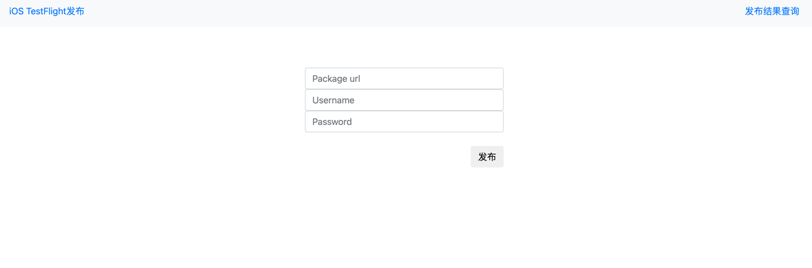
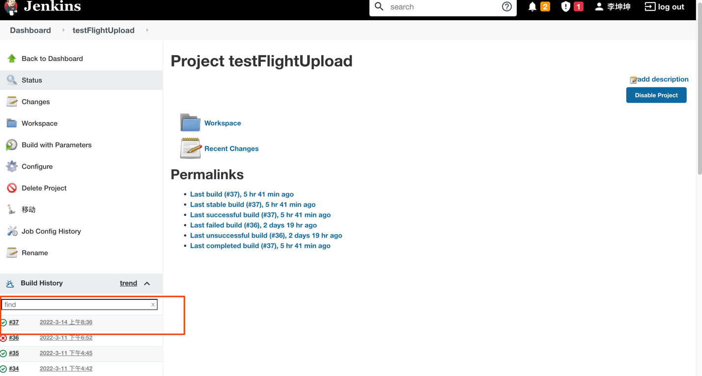
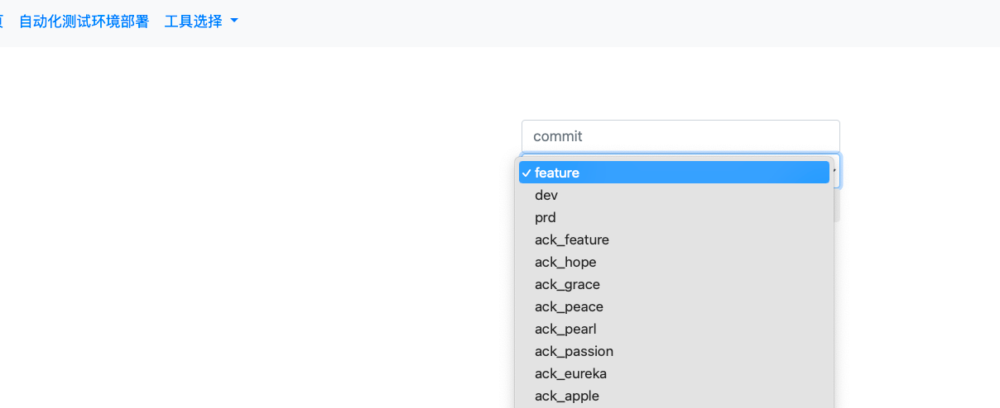
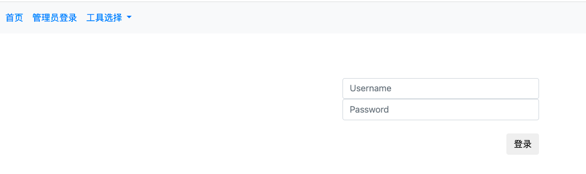
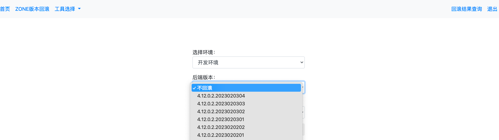
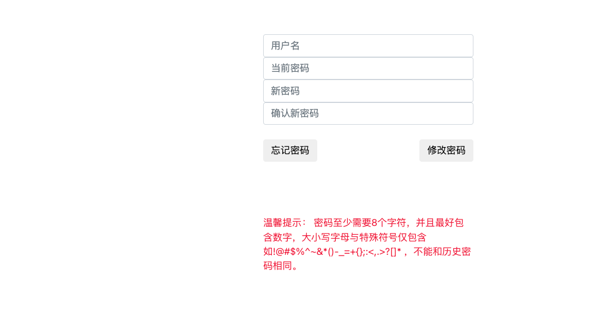

## 内部自动化常用工具

#### 部署
采用docker部署方式：
* 构建镜像：docker build -f Dockerfile -t ios_testflight_upload:tag .
* 启动容器：docker run -it -r -m -d -p 5000:5000 ios_testfilght
* 查看容器是否启动：docker ps | grep ios_testfilght
* 测试：curl http://本机ip:5000
* 或直接执行deploy.sh制作镜像

### ios testflight包发布工具
访问页面：

* 填写package url 包的下载地址
* 苹果官网app管理者账号
* 账号密码
* 点击发布，开始发布
* 上传结果点击发布结果查询会跳转到jenkins查看任务状态 - 》发布成功

  
### 自动化测试环境部署
方便zone开发人员部署一套自己使用的成型的自动化测试环境，填写git commit信息，选择部署k8s集群namespace
即可

### ZONE版本回滚
方便zone开发人员在运维不在现场的时候回滚各个环境的不同版本，此功能需要管理员TL有权限登陆操作回滚
选择回滚环境和回滚的镜像tag进行部署

### ldap自助修改密码：
提供工具给开发人员修改登陆运维系统（jenkins，jira，confluence等）的密码

 http://xxx.xxx.xxx.xxx:5000/ldap_manage/update_passwd